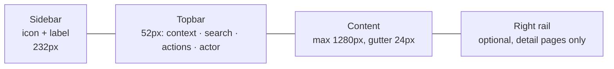

# 01-ui-kit.md — Twentytoo: the design language and UI kit

**Status:** Live design record, drafted 2026-08-14 from the reference screen set (nine screenshots of Linear/Attio/Notion-generation internal tools). This is the design intent for the built-in templates and static assets described in `00-architecture.md` §8; where the two docs disagree, 00 wins and this doc is amended.
**Stack constraint:** HTML over the wire — MiniJinja templates, CSS, one vendored htmx script, and at most one optional vanilla-JS enhancement script. No JS framework, no build step, no CSS framework.
**Scope:** Light mode only (§4.6). Dark mode is a later, additive slice.

---

## 1. Purpose

`00` answers *what* the framework renders. This doc answers *how it looks and behaves*: a single, implementable design language for every generated page, every built-in template, and every team override — plus the interaction patterns that keep the product feeling modern while the client side stays htmx + CSS + a handful of vanilla-JS lines.

The question this doc exists to settle: **can an SSR framework with no JS build produce UIs of the same generation as Linear, Attio, and Notion?** The answer is yes — those products' everyday surfaces (tables, forms, badges, filters, dialogs, toasts) are all server-renderable markup plus CSS; the only things that genuinely require a client framework are realtime collaboration and drag-and-drop canvas UIs, which are explicitly non-goals for internal tools (§12).

Three claims the whole kit is built on:

1. **Design tokens, not components, are the theming surface.** Teams re-brand by overriding CSS custom properties (`--tt-*`); they never fork templates to restyle.
2. **The class names in the built-in templates are a contract.** User template overrides stay on-design by reusing the same classes; the kit documents them as such.
3. **Every interaction is a progressive enhancement.** With JS disabled the product is plain forms and links; htmx upgrades them in place; the optional JS script only does what CSS cannot (auto-dismiss a toast, remember a sidebar state).

## 2. The reference set and what it teaches

### 2.1 The screens

Nine screens were supplied as the visual direction. Identified as the following surface types (one "reference family", not one product):

| Screen | Surface | Notable traits |
| --- | --- | --- |
| Task detail (Linear-style) | Detail page: nav sidebar + main column + right insights rail | Teal "Done" badge, avatar chips, stat table + feedback quotes in the rail, soft card shadows |
| Customer list (Attio-style) | List page + record side card | Dense 4-column table, colored team badges, KPI stat card (1,198 / 92% / 75 / 85%), square company logo, right rail card |
| Documents home (Notion-style) | Grid home + account dropdown | Narrow icon rail, search topbar, rounded placeholder cards, orange "Upgrade" CTA, profile dropdown |
| Profile settings | Two-column form page | "Profile Completion" meter, photo upload card, textarea, platform toggle list (GitHub, Slack), green helper block |
| Security & auth settings | Flat settings page | Section cards, sessions table with status column, per-row action buttons ("Enable", "Add"), red destructive link |
| Customer table, dark | Same list surface, dark palette | Same density/hierarchy as the light table — kept as the dark-mode proof of the token model, not a palette source |
| Three-panel dashboard | App shell with dark nav | Dark sidebar with magenta accent, segmented menu tabs, calendar widget, "Upgrade plan" bottom card, right search/AI panel |
| Sprint task list | List + toolbar + progression rail | Back/forward + search toolbar, dark primary button, view tabs (List/Tasks/Sprints/Dashboard), colored status tags, "Progression" right rail |
| Recent-requests dashboard | Card feed home | Colored initial avatars, status chips ("Active" / "on break"), "Show more" progressive reveal |

### 2.2 Shared traits (the extracted scheme)

Across all nine, the same moves repeat. These are the design language:

- **Chrome is quiet, content is the contrast.** Page backgrounds are near-white gray; every surface is white with a 1px gray border. Color appears only where it means something: one accent hue, semantic status hues, colored team dots.
- **Hierarchy comes from weight and gray, not size.** Titles are 500–600 weight, barely larger than body; secondary text steps down through gray-500/400; micro-labels are uppercase-ish small caps in gray.
- **Tables are the primary surface.** Dense (13–14px), hairline row separators, muted secondary cells, the first column carries the record identity (name + sub-line), status as dot + label chips rather than raw text.
- **Badges are soft pills.** Status is a tinted pill (soft bg, tinted text, tinted border) — never a loud solid block. Team/status dots are a desaturated set (red/orange/green/blue/purple/gray).
- **Avatars are deterministic colored circles with initials** — no image upload required to look alive.
- **Depth is borders first, shadows second.** Cards read through their 1px border; shadows are tiny and reserved for overlays (dropdowns, dialogs) and the occasional floating card.
- **The shell is consistent:** left nav (icon rail or icon+label sidebar), topbar with page context + search + primary action + actor menu, content column with generous gutters, and an optional right rail on detail pages.
- **Radii are small and uniform:** 6–8px on controls and cards, full pills for badges. Nothing squircle, nothing glassy.
- **Interaction feedback is immediate but server-honest:** hover states on rows, `:focus-visible` rings, loading spinners in place of buttons, skeletons for first paint.

### 2.3 What we adopt and what we reject

Adopted: the trait list in §2.2 wholesale — palette structure, table treatment, badge/avatar language, shell anatomy.

Rejected from the screens:

- **Dark nav sidebars** (screen 7). Light-mode-only scope means the nav is white with gray text, same as the content chrome. A dark "inverted" shell variant is possible later off the same tokens (§4.6).
- **Gradient logo art / abstract blobs** (screen 1) — brand territory, not framework territory. Teams add it themselves if they want it.
- **Solid loud CTAs** ("Upgrade to Pro" orange) — the framework's primary action is a single accent color; marketing-colored buttons are a team override.
- **Every interaction be JS-free? No — but every interaction must *degrade*** to a plain HTTP form/link. Native `<dialog>`, `hx-boost`, and OOB swaps cover the modern set without a framework.

## 3. Design principles (UI-specific)

These extend 00 §3 with the visual contract:

- **Monochrome by default, color by meaning.** Grays do layout, hierarchy, and state; the accent marks exactly one thing per surface (the primary action); semantic hues mark status only.
- **Density over decoration.** Internal tools are read hundreds of times per hour. Default to information-dense (13–14px type, 8px grid, hairline separators) and let spacing, not decoration, create calm.
- **Server truth over optimistic UI.** Internal tools describe money, accounts, permissions. The default is server-confirmed state with in-place feedback (spinner → updated fragment). Optimistic flips are opt-in per control (§8.8).
- **Everything keyboard-and-screen-reader first.** The no-JS path and the assistive-tech path are the same path; enhancements ride on top of semantic HTML.
- **One accent, one radius family, one type scale.** Variance is expressed through the token values, not through per-page improvisation.
- **The kit is declarative.** A team brands by setting ~20 CSS variables; they never restyle generated markup by hand.

## 4. Foundations: the design tokens

All tokens are CSS custom properties, namespaced `--tt-*`, defined once in `tokens.css` under `:root`. Light mode only: there is no media-query variant yet, and nothing outside `tokens.css` hardcodes a color (§4.6).

### 4.1 Color

The neutral ramp is zinc-based; text steps must hit AA contrast on white.

```css
:root {
  /* surfaces */
  --tt-bg: #f7f7f8;          /* app background (screens: light gray canvas) */
  --tt-surface: #ffffff;     /* cards, tables, dialogs */
  --tt-surface-2: #fafafa;   /* nested surfaces, hover fills */
  --tt-surface-3: #f4f4f5;   /* pressed fills, skeleton base */

  /* text — steps of gray, not black */
  --tt-text: #18181b;        /* primary (zinc-900) */
  --tt-text-2: #52525b;      /* secondary (zinc-600) */
  --tt-text-3: #71717a;      /* muted cells, hints (zinc-500, AA on white) */
  --tt-text-4: #a1a1aa;      /* placeholders, disabled only — never body text */

  /* borders */
  --tt-border: #e4e4e7;      /* default hairline (zinc-200) */
  --tt-border-2: #d4d4d8;    /* emphasized: inputs, hover borders (zinc-300) */

  /* accent — the ONLY brand decision; default carries over from 00 §8.6 */
  --tt-accent: #2563eb;
  --tt-accent-hover: #1d4ed8;
  --tt-accent-soft: #eff6ff;      /* selected row, active nav bg */
  --tt-accent-soft-border: #bfdbfe;

  /* semantic — soft-pill triplets: text / bg / border */
  --tt-success: #059669;  --tt-success-soft: #ecfdf5;  --tt-success-border: #a7f3d0;
  --tt-warning: #b45309;  --tt-warning-soft: #fffbeb;  --tt-warning-border: #fde68a;
  --tt-danger:  #dc2626;  --tt-danger-soft:  #fef2f2;  --tt-danger-border:  #fecaca;
  --tt-info:    #0284c7;  --tt-info-soft:    #f0f9ff;  --tt-info-border:    #bae6fd;

  /* status dots — desaturated, distinguishable, assigned by hash or config */
  --tt-dot-red: #ef4444;   --tt-dot-orange: #f97316;
  --tt-dot-green: #10b981; --tt-dot-teal: #14b8a6;
  --tt-dot-blue: #3b82f6;  --tt-dot-indigo: #6366f1;
  --tt-dot-purple: #8b5cf6;--tt-dot-amber: #f59e0b;
  --tt-dot-gray: #9ca3af;
}
```

Rules:

- A template may only reference `--tt-*` tokens (plus `transparent`/`currentColor`). Raw hex values in templates/CSS are a review failure.
- Semantic hues are **soft-pill triplets only** — tinted text on tinted background with tinted border. Solid red/green fills are reserved for destructive-confirmation and nothing else.
- Accent choice is a deployment decision (`:root` override in one custom CSS file); the default stays the blue from 00 §8.6 rather than adopting any one screen's teal/magenta/orange.

### 4.2 Typography

System stack (already in use), one scale, weights 400/500/600 only:

```css
--tt-font-sans: system-ui, -apple-system, "Segoe UI", Roboto, "Helvetica Neue", Arial, sans-serif;
--tt-font-mono: ui-monospace, "SF Mono", Menlo, Consolas, monospace; /* ids, amounts, keys */
--tt-text-xs: 12px;   /* micro labels, badges, table meta */
--tt-text-sm: 13px;   /* dense table default */
--tt-text-md: 14px;   /* body, controls */
--tt-text-lg: 16px;   /* card titles, section headings */
--tt-text-xl: 20px;   /* page title — the largest type in the kit */
```

- Table cells: 13px; form controls and body: 14px; page title: 20px/600. Nothing in the framework renders above 20px.
- Tabular data (amounts, ids, counts) uses `font-variant-numeric: tabular-nums` — never mono unless it's an actual identifier (API key, UUID).
- Micro-labels above sections: 12px/500, letter-spacing 0.02em, `--tt-text-3` — the "uppercase feel" without `text-transform: uppercase` (keeps i18n honest).
- Weights: 400 body, 500 for table identity cells, nav active, labels; 600 for titles and buttons. No lighter-than-400, no heavier-than-600.

### 4.3 Spacing, sizing, density

4px base grid, named stops:

```css
--tt-s-2xs: 4px; --tt-s-xs: 8px; --tt-s-sm: 12px; --tt-s-md: 16px;
--tt-s-lg: 24px; --tt-s-xl: 32px; --tt-s-2xl: 48px;
```

Density constants: table cell padding `8px 12px`, row height ~36px; card padding 16–20px; page gutter 24px (32px ≥1200px viewports); section gap 24px; control height 32px (36px for touch-target primary actions in topbars).

### 4.4 Radius and shadow

```css
--tt-radius-sm: 4px;   /* checkbox-style edges, tags */
--tt-radius-md: 6px;   /* buttons, inputs, pagination */
--tt-radius-lg: 8px;   /* cards, tables (outer), dialogs */
--tt-radius-full: 999px; /* pills: badges, avatars, dots */

--tt-shadow-sm: 0 1px 2px rgb(16 24 40 / 0.06);  /* floating cards, rail cards */
--tt-shadow-md: 0 4px 8px -2px rgb(16 24 40 / 0.08), 0 2px 4px -2px rgb(16 24 40 / 0.04); /* dropdowns */
--tt-shadow-lg: 0 12px 24px -4px rgb(16 24 40 / 0.12); /* dialogs */
```

Borders are the default depth mechanism; shadows appear only on overlays and explicitly floating cards. No shadow on tables, forms, or flat cards (screens 5/6 are the evidence — flat cards read as cards through border + background alone).

### 4.5 Layout constants and z-order

```css
--tt-shell-sidebar: 232px;   /* icon + label nav */
--tt-shell-rail: 56px;       /* collapsed icon-only nav */
--tt-shell-topbar: 52px;     /* topbar height */
--tt-shell-content-max: 1280px;
--tt-z-sticky: 10; --tt-z-dropdown: 100; --tt-z-dialog: 200; --tt-z-toast: 300;
```

### 4.6 Light mode only — and why the tokens still matter

Dark mode is **out of scope** (it was already in 00 §12's dropped list). The token layer is still the right structure because:

- Teams re-brand through `:root` overrides without forking templates — the point of §1 claim 1.
- A future dark slice becomes "add a `[data-theme=dark]` token block", additive, no template churn.
- The dark customer-table screen in the reference set already proves the design language survives a palette flip; nothing in §7 depends on a specific background.

Until then: no `prefers-color-scheme` handling, no dark block shipped. Teams wanting dark mode ship their own token override — unsupported, but structurally possible.

## 5. CSS architecture

### 5.1 Files, layers, and delivery

Hand-rolled CSS, no preprocessor, no Tailwind, no PostCSS. The single current `web/static/css/app.css` splits into five files, all embedded by the existing `build.rs` table and linked in `layout/base.html.j2` in this order:

| File | Owns |
| --- | --- |
| `tokens.css` | Every `--tt-*` custom property (§4). |
| `base.css` | Reset-lite (box-sizing, margins), element defaults (body type, links, headings, `:focus-visible` ring), `@media (prefers-reduced-motion)` kill-switch |
| `layout.css` | The app shell (§6): sidebar, topbar, content column, rail, auth shell |
| `components.css` | Everything in §7 |
| `utilities.css` | A small, deliberate utility set (§5.3) |

Cascade ordering is enforced with `@layer tt.tokens, tt.base, tt.layout, tt.components, tt.utilities;` — layer order beats source order, so team overrides (unlayered, loaded after) always win without `!important`.

Rules for contributors: one component per section in `components.css`, commented with its §7 number; no `!important` in framework CSS; media queries live next to the component they affect (mobile = stacked sidebar → topbar disclosure, tables get horizontal scroll, page gutters collapse to 16px).

### 5.2 Naming

BEM-lite, and **the existing short class names are the contract** — `.btn`, `.badge`, `.card`, `.table`, `.field`, `.toolbar`, `.pagination` stay; the kit extends them rather than renames:

- Block: `.btn`, `.table`, `.badge`, `.card`, `.menu`, `.dialog` …
- Modifier: `.btn--primary`, `.btn--sm`, `.badge--success` …
- State: `.is-active`, `.is-loading`, `.is-open`, `.has-error` (states only — never styled by bare element location).
- Element (only where needed): `.card__title`, `.table__cell-actions`.

Dots and avatars share one system: `.dot .dot--red`, `.avatar .avatar--blue` (hue chosen deterministically, §7.3).

### 5.3 Utilities

A closed set, deliberately small — utilities are for spacing/flex in custom team templates, not a Tailwind re-implementation:

```
u-flex, u-flex-col, u-gap-xs..lg, u-grow, u-between, u-center,
u-muted, u-small, u-truncate, u-num (tabular-nums), u-hidden, u-sticky
```

Nothing else gets promoted to utility; when a team needs more, they write component CSS. This is the fence that keeps the stylesheet from becoming a utility swamp.

### 5.4 The theming contract

- **Tokens are the public theming API.** A team's `brand.css` overrides `--tt-*` on `:root`; nothing else needs to change.
- **Classes are the template contract.** User templates reusing `.btn`, `.badge`, `.table` inherit the design language and future fixes for free; documented in `web/templates/README.md`.
- Custom fonts: override `--tt-font-sans` and self-host the font file (same embedded-asset route as htmx). No font CDNs.

## 6. The app shell

One shell for every authenticated page; `layout/auth` stays the centered-card login shell.



- **Sidebar** (`.sidebar`): brand mark top (icon + name, links home), resource nav from the registry (`Resource::icon()` + `label()`), active item = accent-soft background + accent text + 500 weight; the gated Users entry when auth is on. Collapsible to the 56px icon rail (persisted via the optional JS, §9). Below 768px: hidden behind a topbar disclosure menu.
- **Topbar** (`.topbar`): page context left (resource label / breadcrumb), centered search, right side: primary action button + actor menu (avatar + name + dropdown with logout). Sticky (`--tt-z-sticky`), white, hairline bottom border — the "quiet chrome" from §2.2.
- **Content**: single column, max 1280px; list/detail/form pages own their internal layout. The **right rail** (`.rail`) is used on detail pages for side cards (stats, meta, activity) — mirrors screens 1/2/8 — and is simply the second grid column, present only when the page template declares it.
- **Footer**: none. No footer on any built-in page; the chrome ends at content.

All shell navigation uses `hx-boost` (§8.2) so the sidebar and topbar never re-render between navigations.

## 7. Component inventory

Every component below ships with: anatomy (classes), default + hover + active + focus + disabled states, the htmx attribute pattern that drives it (§8), and its degrade path. Specs here are the source of truth for the next implementation slice.

### 7.1 Buttons (`.btn`)

```
.btn            base: 32px height, radius-md, 14px/500, border --tt-border, surface bg
.btn--primary   accent bg, white text; hover accent-hover
.btn--danger    outline: danger text+border, soft bg on hover (destructive confirm uses solid danger)
.btn--ghost     no border/bg, text-2; hover surface-2 — for icon rows and table actions
.btn--sm        28px, 13px — table row actions
```

States: `.is-loading` swaps label for an inline 14px spinner (CSS animation) and disables; `.is-disabled`/`[disabled]` = 45% opacity + `cursor: not-allowed`; focus = 2px `--tt-accent` ring, offset 2. Buttons are `<button>` or `<a>` with identical classes; htmx posts carry `hx-disabled-elt="find button"` so double-submit is impossible (§8.7).

### 7.2 Badges and status (`.badge`, `.dot`)

```
.badge            pill, radius-full, 12px/500, padding 2px 8px, neutral: surface-3 bg, text-2
.badge--success | --warning | --danger | --info | --accent   soft triplet from §4.1
.dot .dot--red | --orange | --green | --teal | --blue | --indigo | --purple | --amber | --gray
```

`Badge { options }` fields map each option label → one semantic class (config order = semantic order; unknown options fall back to neutral). Status in tables renders as dot + text (`<span class="dot dot--green"></span> Active`), never a bare colored word. Badges are the only elements allowed to use `--tt-dot-*` hues; no element is ever a solid red/green/gray block except the destructive confirm button.

### 7.3 Avatars (`.avatar`)

Initials circles, 20/24/28px (`--sm/--md/--lg`), 12–13px/500 white text, background = hue from a deterministic hash of the name across the `--tt-dot-*` set (no random on every render — the same person is the same color everywhere, matching screens 1/9). Fallback when no name: neutral gray + person icon. Image variant (`.avatar--img`) exists for the users area once image uploads land (§12). Grouped avatars stack with a 2px surface border and -4px overlap.

### 7.4 Tables (`.table`) — the flagship component

```
.table                 surface bg, radius-lg, border --tt-border, overflow clip
.table th              sticky header (--tt-z-sticky), 12px/500 --tt-text-3, letter-spacing .02em,
                       8px 12px padding, hairline bottom, surface bg (not surface-3)
.table td              13px, 8px 12px, hairline row separators, vertical-align middle
.table tr:hover        surface-2 row tint
.table td:first-child  identity cell: 500 weight + sub-line (12px, --tt-text-3) underneath
```

- **Sortable headers** are links: `aria-sort="ascending|descending|none"` + chevron indicator; click = `hx-get` on the list route with `sort=` params (§8.4).
- **Row actions** (edit/delete) sit in the last column as ghost buttons, revealed on row hover, always present in the keyboard/JS-disabled path.
- **Amounts, ids, counts** get `u-num`; ids get mono.
- **Empty/loading states** inside the table body are first-class rows (§7.12).
- Small screens: `overflow-x: auto` wrapper — tables never reflow into card lists.

### 7.5 Forms and validation (`.form`, `.field`)

```
.form              surface bg, radius-lg, border, 20px padding, max 720px
.form--two-col     grid for settings-style pages (screens 4/5): label column left, control right
.field             16px rhythm; label 14px/500 + optional .req (danger asterisk)
.field input/select/textarea   height 32px (textarea auto), radius-md, border --tt-border,
                              focus: accent ring; hover border-2
.field.has-error   danger border + .field-error (13px danger, icon + message)
.field .hint       text-3 12px helper line
```

- **Toggle switches** (`.switch`): a styled checkbox — 36×20 track, 16px thumb, accent when on; screen 4's platform list uses these. Pure CSS, no JS.
- **Selects/multi-selects** render native controls (badge-style chips for chosen values in multi-select). No custom dropdown widget in v1 — native is keyboard-correct for free (§12 notes the escape hatch).
- Validation is engine-owned: 422 re-renders the form with `.has-error` fields and messages; errors from a mutation `hx-post` come back as a swapped form fragment + toast (§8.6). The kit only styles the states.
- Checkboxes/radios: native, accent-colored via `accent-color`.
- File/image uploads: hidden until the upload slice (§12); the card treatment (screen 4's "Add new image") is specced here so it lands styled.

### 7.6 Cards and KPI stats (`.card`, `.stat`)

```
.card            surface bg, radius-lg, border; .card__title 16px/600, .card__body
.card--hover     interactive card: hover border-2 + shadow-sm (dashboard home cards)
.stat            KPI block: 12px/500 --tt-text-3 label, 24px/600 value (u-num), 12px delta
                 (↑ green / ↓ danger, tinted) — screens 2's 1,198 / 92% / 75 / 85% arrangement
.stat--sm        20px value — the rail-side compact variant (screens 1/8)
```

The dashboard home (§00 7.1) renders resource cards as `.card--hover` with a count sub-line; when the metrics slice lands, its five shapes (§00 5.8) all compose from `.stat` blocks.

### 7.7 Tabs (`.tabs`)

Two variants, both plain links:

```
.tabs             segmented control: surface-2 track, radius-md, active tab = surface bg + border + shadow-sm,
                  14px/500 — the view switcher from screens 7/8
.tabs--underline  hairline underline style: active = accent text + 2px accent underline — detail-page sections
```

Both are links (`hx-boost`/`hx-get` with `hx-push-url`), so tabs are bookmarkable and degrade to navigation. Relationship tabs (§00 5.1) will use `.tabs--underline` when the slice lands.

### 7.8 Dropdown menu (`.menu`)

```
.menu            anchored popover: surface bg, radius-lg, border, shadow-md, min-width 192px,
                 items = 32px rows, 14px, icon + label (screens 3/9)
.menu__item      hover surface-2; .menu__item--danger danger text; .menu__divider hairline
```

Two openings: the actor menu (avatar in topbar) and row "⋯" action menus. JS-disabled degrade: the actor menu is a link to a profile/logout page; row menus are individual action links (which is what the ⋯ collapses). Implementation prefers `<details>` + CSS anchor positioning where it suffices; the optional JS closes-on-outside-click and on Escape, and repositioning edge cases are deferred (§12).

### 7.9 Dialogs (`.dialog`)

Native `<dialog>` + `::backdrop` (surface blur 0, `rgb(0 0 0 / .32)`):

```
.dialog           surface bg, radius-lg, shadow-lg, 16px padding, 400–560px width
.dialog__title / __body / __actions (actions right-aligned: ghost + primary)
```

Open flow (htmx): `hx-get="/{key}/{id}/delete-confirm"` targeting a shared dialog element swaps the innerHTML and calls `showModal()` via `HX-Trigger` — or a tiny inline handler. Cancel = `<button value="cancel" formmethod="dialog">`; confirm = `hx-post` that targets the dialog (swap to empty + close on 204). Focus trapping, Escape, and `role=dialog` come free from the element — this is the pattern screens 3's profile dropdown and every confirm flow uses. Without JS, confirm actions are their own GET pages with a form — the degrade path.

### 7.10 Toasts / flash (`.toast`)

```
.toast            surface bg, radius-lg, border + shadow-md, icon + 14px message, bottom-right stack
.toast--success | --error | --info   icon hue per kind
```

Server truth, zero-JS path: mutations respond with `HX-Redirect` plus an `HX-Trigger` `{"tt:toast": {kind, message}}` header. The redirect destroys the current document, so the enhancement script stashes the trigger payload in `sessionStorage` and renders the toast into `#toasts` on the redirected page (`<div id="toasts" role="status" aria-live="polite">` in the layout); the optional JS also auto-dismisses after ~4s (pause on hover). OOB-swap toasts remain available for non-redirecting swaps, but every built-in mutation redirects, so the trigger+flash path is the shipped one. Plain full-page posts get the 303 without a toast — the state change itself is the feedback. This replaces the inline `.alert` block as the default mutation feedback; `.alert` stays for full-page form errors (login).

### 7.11 Pagination (`.pagination`)

Numbered pages and prev/next (cursor mode, §00 5.4) share one style: 28px square page buttons (current = accent bg, white text), chevron edge buttons, `aria-current="page"`. All links are `hx-get` + `hx-target="#list"` + `hx-push-url`, degrading to plain links. Scroll-to-list-top on swap (§8.4).

### 7.12 Empty and loading states

- **Empty table** (`.empty`): centered in the table body — icon (20px, text-3), title 14px/500, hint line 13px text-3, one ghost action button ("Create first …"). Rendered when `items` is empty and no filter is active.
- **Empty filter result**: same block, different copy ("No results match your filters"), plus a "Clear filters" ghost button.
- **Skeleton** (`.skeleton`): shimmering `surface-3` bars; shown as the initial list fragment (server-rendered) for the first paint after a page load, replaced by the real fragment. Subsequent htmx swaps show the toolbar spinner instead (`.is-loading` on the list container at 60% opacity) — skeletons only for first paint.
- **404/403 within a resource**: quiet empty-state card, no raw error text.

### 7.13 Icons

An inline-SVG icon set, ~20 names, stroke-based (1.5px, `currentColor`, 16px default / 20px for chrome): `home, search, inbox, filter, sort, plus, chevron-down, chevron-left, chevron-right, more-horizontal, edit, trash, x, check, users, settings, logout, file, calendar, dot, external, alert, spinner`. No icon font (fonts fight the embedded-binary model), no icon JS. Rendered by a template macro `{{ icon(name, size=16) }}` emitting inline SVG — server-rendered, styleable via CSS, zero extra requests. `Resource::icon()` (`&'static str`, default `"cube"` — 00 §5.1) draws from this set; unknown names render a neutral `dot` fallback and fail the boot check (§11.3). The set is deliberately closed: a new icon is a PR to the kit, keeping the binary lean.

## 8. Interaction patterns with htmx

The modern-feel capability map: what the screens do, and how the kit does it with zero framework JS.

### 8.1 The one rule

Every htmx control is a **URL-producing control**: it must have a plain-HTTP equivalent (link, form submit, or query-string state). If a control can't state its effect as a URL, it doesn't ship. This keeps the no-JS path real and makes every state shareable.

### 8.2 Shell navigation: `hx-boost`

The sidebar, topbar breadcrumbs, and card links carry `hx-boost="true"`; the layout's `<main>` is the swap target via a layout-level `<div id="main" hx-target…>` — standard pattern: boost swaps `body` into `body` but the kit scopes it to `main` so the sidebar/topbar never flicker. Combined with View Transitions (§8.5) this reads as an SPA to users. Back/forward and bookmarks work because every navigation is a real URL.

### 8.3 The list fragment contract

The list page (`resource/list.html.j2`) is one partial — `#list` = toolbar (search + filters + view toggles) + table + pagination — rendered by `GET /{key}` with and without `HX-Request` (full page vs. fragment). Every list control targets `#list` with `hx-swap="outerHTML"`:

- **Search**: `hx-get` + `hx-trigger="input changed delay:400ms, search"` + `hx-push-url="true"` — screens' debounced topbar search.
- **Filters**: the filter form `hx-get` on `change` (checkbox/select), preserving the rest of the query string.
- **Sort**: header links (§7.4) — `hx-get` with `sort=`, `aria-sort` updated on swap.
- **Pagination**: `hx-get` + `hx-swap="outerHTML show:#list:top"` so page flips land at the table top.
- **View toggles** (density? saved views?): not shipped until the saved-filter slice (§12) — the toolbar currently has exactly search + filters + create button.

The engine already renders a plain-HTML fallback for all of these (§00 8.6); the kit's job is making the enhanced and degraded states indistinguishable in appearance.

### 8.4 URL state as the source of truth

Every list mutation of state (search, sort, filter, page) sets `hx-push-url="true"` — the URL *is* the view state, exactly like the screens' shareable filtered tables. No client-side state objects, no session storage for view state. The only client-persisted UI state in the whole product is the sidebar collapsed flag (§9), and even that is cosmetic.

### 8.5 Transitions

View Transitions API, opt-in per swap: `hx-swap="outerHTML transition:true"` on list swaps and `htmx.config.globalViewTransitions` off by default; `::view-transition-old/new` fades at 120ms via `base.css`. Gated by `@media (prefers-reduced-motion: reduce)` which disables transitions globally (htmx config respects the flag at runtime). Browsers without the API silently get instant swaps — the degrade is invisible. No animation library, ever.

### 8.6 Loading and progress feedback

- **In-place buttons**: `hx-indicator` + `.is-loading` spinner (§7.1); `hx-disabled-elt="find button"` prevents double-posts.
- **List swaps**: the `htmx-request` class on `#list` dims it to 60% opacity during the flight; a slow request (threshold via htmx's `hx-indicator` on the toolbar) shows the toolbar spinner.
- **First paint**: server-rendered skeleton rows (§7.12), swapped by the first fragment.
- **Toasts**: `HX-Trigger` + sessionStorage flash per mutation (§7.10) — the screens' "did the thing" feedback.

### 8.7 Writes: server-confirmed by default

Create/edit/delete are `hx-post` on forms targeting the page region: 422 re-renders the form fragment in place; success answers with `HX-Redirect` + a `tt:toast` trigger, the client renders the toast on the landed page (§7.10). No optimistic flips anywhere in v1 — the one place optimism is *allowed* later is `.switch` toggles (flip instantly, reconcile on the response, revert on error), specced but not shipped (§12).

### 8.8 Detail-page composition

Detail pages compose from independent fragments: header (title + badge + actions), field list, right-rail cards, relationship tabs (§7.7). Each fragment is its own route (`GET /{key}/{id}/…`) so future inline editing can swap a single card without a page reload — same architecture the screens' rail cards imply, no client state.

### 8.9 The degrade matrix

| Pattern | Enhanced (htmx) | Degraded (no JS) |
| --- | --- | --- |
| Nav | `hx-boost` into `main`, transitions | plain links, full reload |
| Search | debounced fragment swap | form submit + Enter |
| Filters | `change` fragment swap | form submit |
| Sort/pagination | fragment swap | plain links |
| Create/edit | in-place form swap, toast | full-page form post, `.alert` |
| Delete | dialog + swap + toast | confirm page with form |
| Tabs | fragment swap | plain links |
| Actor menu | dropdown | profile page link |

## 9. The vanilla JS policy

**Baseline: zero JS ships by default.** `layout/base.html.j2` loads only the vendored htmx script. One optional script — `web/static/js/app.js`, embedded like htmx, `<script defer>` after htmx, no build step, plain ES (IIFE or module, no imports beyond browser globals) — provides exactly four behaviors CSS cannot:

1. **Toast auto-dismiss** (4s, pause on hover, then remove the node).
2. **Sidebar collapse** — toggles the icon rail, persists to `localStorage` under one key.
3. **Dropdown close on outside-click and Escape** (only when a dropdown isn't the `<details>` variant).
4. **View-transition/htmx config defaults** that need to run before the first swap.

The pattern for all of it: **declarative targets + delegated listeners** — `data-tt-collapse`, `data-tt-menu`, `data-tt-toast` attributes; `document.addEventListener` delegation, never per-element binding. This is non-negotiable because htmx swaps replace DOM nodes; per-element bindings die on the first swap. The whole file stays under ~2KB; anything larger is a signal the feature needs a different design, not more JS.

Forbidden by policy: jQuery, Alpine, htmx extensions beyond the vendored core, any NPM pipeline, any state library. If a future feature genuinely needs rich client behavior (drag-drop, canvas), the answer is a scoped custom page (`into_router()` + the team's own stack), not a framework-wide JS dependency — 00 §12 already drew this line.

## 10. Accessibility

- **Contrast**: all text tokens hit WCAG AA on their backgrounds (`--tt-text-3` = 4.6:1 on white is the floor for any non-placeholder text). Status badge hues are chosen at AA for their text/bg pair.
- **Focus**: a single `:focus-visible` ring (2px accent, 2px offset) on everything interactive; no outline removal anywhere.
- **Motion**: every transition/animation gated by `prefers-reduced-motion` (CSS + htmx config).
- **Semantics**: sortable headers `aria-sort`; tabs `role="tablist"` where JS-free links don't already cover it; dialogs via native `<dialog>`; toasts `role="status"`/`aria-live="polite"`; tables real `<th scope>`; all icons `aria-hidden` with visible/`aria-label` text alternatives.
- **Keyboard**: the no-JS path is the keyboard path — menus, dialogs, and disclosure all work without a mouse because they're links/forms/dialog elements. The optional JS adds exactly two keys (Escape closes dropdowns, `?` shows the shortcut list — future).
- The kit treats an accessibility regression as a bug, same class as a 500.

## 11. Engine integration and migration

### 11.1 Token mapping (current → kit)

Today's `app.css` root maps straight across — the current palette was already pointed the right way:

| Current | Kit | Notes |
| --- | --- | --- |
| `--accent` `#2563eb` | `--tt-accent` | unchanged value |
| `--bg` `#f6f7f9` | `--tt-bg` `#f7f7f8` | 1-step zinc alignment |
| `--text` `#1c2430` | `--tt-text` `#18181b` | |
| `--muted` `#667085` | `--tt-text-2`/`-3` | split into two steps |
| `--border` `#e2e6ec` | `--tt-border` `#e4e4e7` | |
| `--danger` `#dc2626` | `--tt-danger` | unchanged value |

### 11.2 Class contract

`.btn`, `.badge`, `.card`, `.table`, `.field`, `.toolbar`, `.pagination`, `.alert`, `.auth-shell` survive as names; the kit adds modifiers, states, and the new components (§7). The migration slice updates the built-in templates to the kit classes in the same pass as the CSS split — no intermediate naming era.

### 11.3 Boot validation

Extend the existing boot checks (`00` §7.2/§8.5):

- `BUILTIN_ASSETS` gains the five CSS files + `js/app.js` (see `web/templates/README.md` rule 2).
- `Resource::icon()` values are validated against the icon set at build; unknown names fail boot like a mistyped template reference (fail at boot, not first click — 00 §3).
- `Badge { options }` labels longer than N chars render truncated with title — not a boot error.

### 11.4 `format_field` and `form_control`

These MiniJinja functions are where the kit meets the engine. Their output contract updates to: badge pills per §7.2 (`Badge` kind), avatar + name per §7.3 (`Relation` display), `u-num` on `Number`/`Currency`, icon + label for booleans — and every emitted class name is one from §7. The functions remain safe-string (escape internally, 00 §8.3); the kit never changes that rule.

### 11.5 Capability degradation, styled

The §00 5.6 capability matrix already removes UI the source can't honor; the kit documents the *look* of each degraded state (no sort → plain headers, cursor-only → prev/next pager §7.11, no search → toolbar without the box). Degradation must be invisible as a "missing feature" — a read-only resource should look complete, not broken.

## 12. Out of scope / deferred

- **Dark mode** — dropped in 00 §12; the token layer is the seam for a future slice (§4.6).
- **Custom select/multi-select widgets, rich-text editing, drag-and-drop, virtualization** — native controls, pagination, and server rendering cover the internal-tools need; the framework never grows a client-side widget library.
- **Realtime / SSE live updates** — already dropped (00 §12).
- **Image/file upload UI** — the card treatment is specced (§7.5); the field kinds arrive with the upload slice.
- **Optimistic toggles, saved views, keyboard-shortcut palette, command palette** — specced where noted (§8.7, §10), not shipped.
- **Theming presets** (a "teal brand" pack) — the token set makes them trivial for teams; the framework ships only the default.
- **Idiomorph-style morphing swaps** — if swap diffing is ever needed, it's a vendored-script decision revisited then; default swap is sufficient for the kit.

## 13. Decision ledger

| Decision | Choice | Why |
| --- | --- | --- |
| Styling stack | Hand-rolled CSS + custom properties, no Tailwind/preprocessor | No build step for consumers; tokens re-theme without template forks; the framework owns the bytes like every other asset |
| Tokens | `--tt-*` namespace, zinc neutrals, blue-600 default accent | One overridable theming surface; contrast-verified ramp; keeps 00's existing accent |
| Class names | Keep existing short names, extend with BEM modifiers | They're already the template contract; a rename buys nothing |
| CSS delivery | Five layered files embedded via the existing `build.rs` table | `@layer` makes team overrides win without `!important`; no request waterfall beyond plain links |
| JS ceiling | htmx + one <2KB optional `app.js`, delegated `data-tt-*` behaviors | Everything degrades to HTML; delegated listeners survive htmx swaps; a size cap enforces the design |
| Icons | Closed inline-SVG set, stroke 1.5, macro-rendered | No fonts/CDNs/build steps; server-rendered and CSS-tinted |
| Dialogs | Native `<dialog>` | Focus trap, Escape, backdrop for free; degrade = confirm pages |
| Feedback | `HX-Trigger` toast + sessionStorage flash, `.alert` for full-page errors | Survives the redirect navigation; server truth; one toast path |
| Density | 13px tables, 8px grid, hairline borders | Matches the reference set; reads as "modern tool", not "bootstrap admin" |
| Depth | Borders first, shadows only on overlays | Screens 5/6 prove flat cards read fine; fewer shadow recipes to maintain |
| URL state | All list state in the URL (`hx-push-url`) | Shareable/bookmarkable views with zero client state |
| Dark mode | Deferred, tokens as the seam | Out of scope per 00 §12; additive later |
