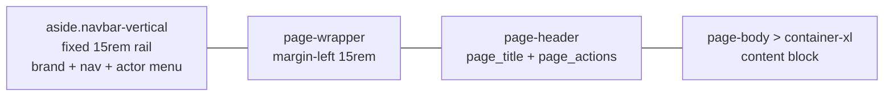

# 01-ui-kit.md — Twentytoo: the design language and UI kit

**Status:** Live design record, amended 2026-08-15: the hand-rolled `--tt-*` design system and the htmx interaction layer were replaced wholesale by the vendored **Tabler 1.4.0** UI kit (Bootstrap-based, MIT). The reference-set analysis (§2, §3) survives unchanged — Tabler was chosen because it already implements that language (quiet chrome, soft badges, dense tables, deterministic avatars, small radii). Where this doc disagrees with `00-architecture.md`, 00 wins and this doc is amended.
**Stack constraint:** HTML over the wire — MiniJinja templates, one vendored Tabler CSS + one vendored Tabler JS bundle (embedded in the binary, never a CDN), and at most one tiny vanilla-JS enhancement script. No build step beyond `cargo build`, no npm pipeline.
**Scope:** Light mode only (§4). Dark mode is a later, additive slice (`data-bs-theme="dark"` is already available per-component, e.g. the sidebar).

---

## 1. Purpose

`00` answers *what* the framework renders. This doc answers *how it looks and behaves*: the Tabler class contract every generated page, every built-in template, and every team override renders against — plus the interaction patterns that keep the product honest (server-confirmed state, URL-as-view-state).

Three claims the whole kit is built on:

1. **Tabler's class names are the template contract.** The built-in templates use stock Tabler markup — `.card`, `.table`, `.badge bg-*-lt`, `.avatar`, `.btn`, `.form-control`, `.modal`, `.toast`. User template overrides stay on-design by reusing the same classes; there is no second, framework-private class language.
2. **Theming is Tabler's CSS variables.** Teams re-brand by overriding `--tblr-*` custom properties in a small CSS file loaded after `tabler.min.css`; they never fork templates to restyle.
3. **Every interaction is a progressive enhancement over plain HTTP.** All navigation is full-page; list state lives in the URL; mutations are POST forms that 303 with a `?flash=` toast. Tabler's JS components (modal, dropdown, toast, navbar collapse) ride on top and need the bundle; forms and links never do.

## 2. The reference set and what it teaches

### 2.1 The screens

Nine screens were supplied as the visual direction (see the original draft's table): Linear-style task detail, Attio-style customer list, Notion-style documents home, profile settings, security settings, a dark customer table, a three-panel dashboard, a sprint task list, and a recent-requests feed.

### 2.2 Shared traits (the extracted scheme)

Across all nine, the same moves repeat. These are the design language:

- **Chrome is quiet, content is the contrast.** Page backgrounds are near-white gray; every surface is white with a 1px gray border. Color appears only where it means something: one accent hue, semantic status hues, colored team dots.
- **Hierarchy comes from weight and gray, not size.** Titles are 500–600 weight, barely larger than body; secondary text steps down through gray.
- **Tables are the primary surface.** Dense, hairline row separators, muted secondary cells, the first column carries the record identity.
- **Badges are soft pills.** Status is a tinted pill — never a loud solid block.
- **Avatars are deterministic colored circles with initials** — no image upload required to look alive.
- **Depth is borders first, shadows second.** Cards read through their 1px border; shadows are reserved for overlays.
- **The shell is consistent:** left nav, page header with title + primary action, content column with generous gutters.
- **Radii are small and uniform; badges are full pills.**
- **Interaction feedback is immediate but server-honest.**

### 2.3 What we adopt and what we reject

Adopted: the trait list in §2.2 wholesale, now delivered by Tabler's components rather than custom CSS.

Rejected from the screens:

- **Gradient logo art / abstract blobs** — brand territory, not framework territory.
- **Solid loud CTAs** — the framework's primary action is a single accent (`btn-primary`); marketing-colored buttons are a team override.
- **SPA shell** — no client-side routing, no partial swaps. Tabler's components are point behaviors, not an app framework.

## 3. Design principles (UI-specific)

These extend 00 §3 with the visual contract:

- **Monochrome by default, color by meaning.** Grays do layout; the accent marks exactly one thing per surface (the primary action); semantic hues mark status only.
- **Density over decoration.** Internal tools are read hundreds of times per hour. Tabler's `table-vcenter`/`card-table` density is the default; spacing, not decoration, creates calm.
- **Server truth over optimistic UI.** Mutations complete server-side, then redirect with a flash toast. No optimistic flips anywhere in v1.
- **Everything keyboard-and-screen-reader first.** Forms and links are native HTML; Tabler's components ship Bootstrap's ARIA wiring.
- **One accent, one radius family, one type scale** — Tabler's defaults.
- **The kit is declarative.** A team brands by overriding `--tblr-*` variables in one CSS file; they never restyle generated markup by hand.

## 4. Theming

Tabler 1.4 ships a complete design-token layer as CSS custom properties (`--tblr-*`) on `:root` — colors, radii, fonts, spacing, component variables (e.g. `--tblr-btn-icon-size`, `--tblr-datagrid-item-width`). That *is* the theming surface:

- A team's `brand.css` (loaded after `tabler.min.css` in their template override) overrides the variables; nothing else needs to change.
- The framework ships no custom tokens and no raw hex colors in templates.
- Dark mode: out of scope per 00 §12, but structurally available — the sidebar already runs `data-bs-theme="dark"`, and a future slice flips `data-bs-theme` on `<html>`.
- Fonts: Tabler's system stack by default; a custom font overrides `--tblr-font-sans` and self-hosts the file through the same embedded-asset route. No font CDNs.

## 5. Assets and delivery

### 5.1 What ships

`web/static/`, embedded into the binary by `build.rs` and served at `/static/{*path}` (`00` §8.6):

| Asset | Role |
| --- | --- |
| `css/tabler.min.css` | The full Tabler 1.4 stylesheet (Bootstrap 5.3 base included). Self-contained: no font files, no icon-font dependency. |
| `js/tabler.min.js` | Tabler's JS bundle: Bootstrap components (modal, dropdown, toast, collapse) + Tabler behaviors. UMD — exposes `window.tabler` (`window.tabler.Toast`, `window.tabler.bootstrap`, …). |
| `js/app.js` | The enhancement layer (§9). |

No custom framework CSS ships. The `.icon` class sizes inline SVG icons via `--tblr-icon-size`; `icon(name, size)` pins the exact pixel size with an inline style override (§7.10).

### 5.2 Upgrading

Re-vendoring is a file copy: download a Tabler release's `dist/css/tabler.min.css` + `dist/js/tabler.min.js` into `web/static/`, keep the boot check (`BUILTIN_ASSETS` in `src/infrastructure/static_files.rs`) green, and re-run the test suite. The class contract is Tabler's public API — upgrading Tabler may change visuals but should not change template markup.

### 5.3 Class contract

Tabler's class names in the built-in templates are the contract: `.card`, `.table .table-vcenter .card-table`, `.badge bg-*-lt`, `.avatar avatar-sm`, `.btn btn-primary|danger|link|ghost`, `.form-label`, `.form-control`, `.form-select`, `.form-check form-switch`, `.modal`, `.toast`, `.pagination .page-item .page-link`, `.empty`, `.datagrid`, `.alert`, `.navbar-vertical`, `.page-header`, `.page-title`. Reuse them; don't invent siblings. Documented in `web/templates/README.md`.

## 6. The app shell

One shell for every authenticated page (`layout/base.html.j2`); `layout/auth.html.j2` stays the centered-card login shell.

- **Sidebar** (`aside.navbar.navbar-vertical.navbar-expand-md`, `data-bs-theme="dark"`): brand mark top (icon + name, links home), resource nav from the registry (`Resource::icon()` + `label()`, `.nav-link-icon` + `.nav-link-title`), active item = `.nav-item.active` (Tabler's 3px left marker), the gated Users entry when auth is on, and the **actor menu** pinned to the rail bottom (`mt-auto` dropdown: avatar + email; Sign out is a plain form POST). Below `md`: Bootstrap collapse turns the rail into an off-canvas drawer driven by the in-rail `.navbar-toggler`.
- **Page header** (`div.page-header`): per-page slots — `page_title` (`h2.page-title`) left, `page_actions` (`.btn-list`) right. Every page fills the slots from its template; the header lives in the base layout, so pages never render their own headings.
- **Content**: `.page-body > .container-xl`, single column, max width from Tabler's container; list/detail/form pages own their internal layout. No footer on any built-in page.
- The **desktop rail collapse** of the previous kit was dropped: Tabler's shell is a fixed 15rem rail with a mobile drawer, and replicating a collapsed rail would mean maintaining custom CSS against Tabler's width variables. Teams that want it ship their own override.

All navigation is plain HTTP — the shell re-renders on every navigation, which is the price of zero client-side routing and is exactly how the previous no-JS path behaved.

## 7. Component inventory

Every built-in surface and the Tabler anatomy it renders. These are the source of truth for the built-in templates; team overrides reuse the same classes.

### 7.1 Buttons

`btn` (secondary), `btn btn-primary` (the one accent per surface), `btn btn-danger` (destructive; solid red only in the delete confirm modal and its trigger), `btn btn-link` (cancel), `btn btn-ghost` (empty-state actions), `btn btn-sm` where the old kit used small. Icons inside buttons ride `.icon` sizing; `btn-list` groups header actions. Double-submit: forms are plain POSTs — the browser's own submit-in-flight behavior applies (no htmx `hx-disabled-elt` equivalent; a JS-disabled double-click is the user's browser's problem, same as every form on the web).

### 7.2 Badges and status

`Badge { options }` fields render as soft pills via `badge_pill` in `templates.rs`: `badge bg-{primary|success|warning|danger|info}-lt`, option position in the declaration = semantic order (config order is semantic order); unknown/empty values fall back to `bg-secondary-lt`. The Users area uses the same pattern (`bg-success-lt` / `bg-warning-lt`).

### 7.3 Avatars

`.avatar avatar-sm` with initials and a deterministic Tabler soft background hue (`bg-{red|orange|green|teal|blue|indigo|purple|yellow|secondary}-lt`) from a hash of the name (`avatar_class` in `templates.rs`) — the same person is the same color everywhere, server- and client-free. Used in the actor menu, the Users table, and relation cells.

### 7.4 Tables — the flagship component

`div.table-responsive > table.table.table-vcenter.card-table` inside a `.card`. First column = record identity (link to detail, `text-reset`), secondary cells `text-secondary`, numeric/currency cells `text-end` (the template checks `col.kind.tag`), badges/booleans via `format_field`. Sortable headers are links in `<th>` with `aria-sort` + a chevron icon; empty states are first-class rows (§7.7). Small screens: horizontal scroll via `table-responsive` — tables never reflow into card lists.

### 7.5 Forms and validation

Resource forms are `.card` with `.card-body` (one `.mb-3` per field: `.form-label` + control) and `.card-footer` actions (Cancel `btn-link`, Save `btn-primary`). Widgets come from `form_control(field, values, errors)`:

- `text/email/number/currency/date/datetime` → `input.form-control` (+ `is-invalid` when the field has an error)
- `textarea/richtext` → `textarea.form-control`
- `select/badge` → `select.form-select`; `multiselect` → `select.form-select[multiple]`
- `boolean` → `label.form-check.form-switch > input.form-check-input`

Validation is engine-owned: 422 re-renders the full form page with `is-invalid` controls + `invalid-feedback` messages, submitted values kept (`render_form_error` / `render_user_form`). The Users form is hand-written markup with the same classes. File/image uploads stay deferred (§12).

### 7.6 Detail pages

`card > card-body > .datagrid`: one `.datagrid-item` per detail field (`.datagrid-title` label, `.datagrid-content` value). Delete lives in a Bootstrap **modal** (§7.9). The right-rail composition of the reference screens stays out of scope — a detail page is one card, which is what the current field set needs.

### 7.7 Empty states

`.empty` inside the table body (`.empty-icon` + `.empty-title` + `.empty-action` with a `btn-ghost`): "No X yet" with a create link, or "No X match your filters" with a Clear filters link. The dashboard home renders resource cards as `.row.row-cards > .col-sm-6.col-lg-3 > a.card.card-link` with icon, title, and record count.

### 7.8 Pagination

`.pagination.pagination-sm` in the card footer (`card-footer`), one `li.page-item` per page: current = `.active` (span, `aria-current="page"`), edges disabled = `.disabled` spans so the layout never shifts, chevron buttons for prev/next (numbered mode) or "Prev/Next" text buttons (cursor mode). All links preserve the query string — the URL is the view state.

### 7.9 Dialogs and toasts

- **Delete confirm**: a Tabler/Bootstrap modal (`modal modal-sm`, `.modal-status.bg-danger`, icon + title + body, footer with Cancel `data-bs-dismiss="modal"` and the real submit button inside a plain POST form). Trigger: `data-bs-toggle="modal" data-bs-target="#delete-dialog"`. Focus trap, Escape, and backdrop are Bootstrap's.
- **Flash toasts**: mutations 303 to their destination with `?flash=<kind>:<message>` (the `Flash` extractor in `presentation/extractors.rs`; kinds `success`/`danger`/`info`). The base layout renders a `.toast.show` in a `.toast-container.position-fixed.top-0.end-0` with `data-bs-toggle="toast" data-bs-autohide="true" data-bs-delay="4000"`; `app.js` hands it to `new tabler.Toast(el).show()` so autohide + close work. Without JS the `.show` class keeps it visible. Form validation errors render `.alert.alert-danger` on the re-rendered page instead.

### 7.10 Icons

The closed inline-SVG set survives unchanged (`ICON_NAMES`/`icon_paths` in `templates.rs`; `icon(name, size)` renders a 24×24 stroke SVG with `class="icon"` plus an inline `--tblr-icon-size:<size>px` so Tabler's `.icon` sizing applies at the exact requested pixel). No icon font, no icon JS, no CDN. `Resource::icon()` draws from the set; unknown names fail the boot check and render a neutral dot fallback.

## 8. Interaction patterns

The modern-feel capability map: what the product does, and how it does it with server rendering + Tabler components.

### 8.1 The one rule

Every control is a **URL-producing control**: links, form submits, or query-string state. If a control can't state its effect as a URL, it doesn't ship. This keeps every view shareable and bookmarkable, and it means the product is fully navigable without JS.

### 8.2 Navigation

Plain links everywhere. The sidebar, header actions, sort headers, pagination, and identity cells are ordinary `<a href>`; the URL *is* the view state (q, filters, sort, page). No pushState, no client-side history.

### 8.3 The list contract

`GET /resources/{key}` renders the full page (`resource/list.html.j2` → `partials/list.html.j2`): a `.card` whose toolbar is a GET form (search `input-icon` + `format_filter` controls + Apply), followed by the table and the pager in the card footer. There is no fragment protocol anymore: every response is a complete document, and the `HX-Request`/fragment branches were deleted from the handlers.

### 8.4 Writes: server-confirmed by default

Create/edit/delete are plain POST forms. Success: 303 → destination + flash toast (§7.9). Validation/conflict: 422 → full form re-render with field errors. No optimistic UI anywhere in v1.

### 8.5 The degrade matrix

| Pattern | Enhanced (Tabler bundle on) | Degraded (no JS) |
| --- | --- | --- |
| Nav, sort, pagination, search, filters | same as degraded — full page loads | identical (no enhancement exists) |
| Create/edit | plain POST form | identical |
| Delete | confirm modal, then POST | **not available** — the modal trigger is inert without the bundle (accepted tradeoff: the modal IS the affordance; a no-JS delete would need a confirm page route, which the framework does not ship) |
| Flash toast | auto-dismiss + close button | visible statically, dismissed by navigation |
| Actor menu | dropdown | not available (Sign out remains reachable via direct POST to `/logout` only in the enhanced menu; the sidebar shows the static email row) |
| Sidebar on mobile | off-canvas drawer | links remain reachable by expanding… without JS the drawer cannot open; the nav links are not duplicated elsewhere (accepted: mobile + no-JS is an unusual corner) |

Everything a user must *do* (view, search, filter, sort, paginate, create, edit) works without JS; the two things that don't (delete confirm, sign-out affordance) are destructive/rare and documented above.

## 9. The JS policy

**Baseline: the Tabler bundle ships by default** — it is the component library the kit is built on, embedded and versioned like every other asset. One script — `web/static/js/app.js`, `<script defer>` after `tabler.min.js`, plain ES, no build step — provides the load-time behaviors data attributes cannot express:

1. **Flash toasts**: hand server-rendered `.toast.show` elements to the Tabler API for autohide/close.
2. (Reserved for future enhancements under the same ceiling.)

The whole file stays small; anything larger is a signal the feature needs a different design. Forbidden by policy: jQuery, Alpine, any npm pipeline, any state library, per-element bindings on server-rendered nodes (delegation only). If a future feature genuinely needs rich client behavior (drag-drop, canvas), the answer is a scoped custom page (`into_router()` + the team's own stack) — 00 §12 already drew this line.

## 10. Accessibility

- **Semantics**: real `<th scope="col">`, `aria-sort` on sortable headers, `aria-current="page"` on pagination, `role="status"`/`aria-live="polite"` on toasts, `aria-hidden` icons with text alternatives, `aria-label` on icon-only controls — Bootstrap's modal/dropdown/collapse ARIA wiring (focus trap, Escape, `aria-expanded`) comes with the bundle.
- **Contrast and focus**: Tabler's palette is AA-verified; `:focus-visible` rings are Bootstrap's defaults (never removed).
- **Motion**: `prefers-reduced-motion` is honored by Bootstrap/Tabler transitions.
- **Keyboard**: forms and links are native; the modal and menu are keyboard-operable through Bootstrap.
- The kit treats an accessibility regression as a bug, same class as a 500.

## 11. Engine integration

### 11.1 `format_field` / `format_filter` / `form_control`

These MiniJinja functions are where the kit meets the engine (`templates.rs`):

- `format_field(value, kind)` — cells and detail values: badge pills per §7.2, avatar+id relation links per §7.3, icon+label booleans (`text-success`/`text-danger`), formatted dates, plain escaped text for numbers/currency (the template right-aligns with `text-end`).
- `format_filter(filter)` — toolbar controls: `form-select.form-select-sm` / `form-control.form-control-sm` with an inline `form-label`, GET-submitted by the toolbar form.
- `form_control(field, values, errors)` — the form widgets of §7.5, including `is-invalid` when `errors[name]` exists.

All three remain safe-string functions (escape internally, 00 §8.3); every emitted class is a Tabler class.

### 11.2 Boot validation

- `BUILTIN_ASSETS` lists `css/tabler.min.css`, `js/tabler.min.js`, `js/app.js`; the boot check verifies each is embedded (`static_files.rs`).
- `Resource::icon()` values are validated against `ICON_NAMES` at build; unknown names fail boot like a mistyped template reference.
- Templates resolve at boot (`BUILTIN_TEMPLATES`) and CI renders every built-in against fixture data.

### 11.3 Capability degradation, styled

The §00 5.6 capability matrix already removes UI the source can't honor: no sort → plain headers, cursor-only → prev/next pager, no search → toolbar without the box. Degradation must be invisible as a "missing feature" — a read-only resource should look complete, not broken.

## 12. Out of scope / deferred

- **Dark mode** — dropped in 00 §12; `data-bs-theme` is the seam for a future slice.
- **Custom select/multi-select widgets, rich-text editing, drag-and-drop, virtualization** — native controls and server rendering cover the internal-tools need.
- **Realtime / SSE live updates** — already dropped (00 §12).
- **Image/file upload UI** — the field kinds arrive with the upload slice.
- **Optimistic toggles, saved views, keyboard-shortcut palette** — specced elsewhere, not shipped.
- **Desktop sidebar rail collapse, no-JS delete confirmation, no-JS actor menu** — dropped with the htmx-era shell (§6, §8.5); Tabler's shell and component model don't provide them, and the framework does not maintain custom CSS/JS to fake them.
- **htmx / partial-swap morphing** — removed; full-page navigation is the interaction model.

## 13. Decision ledger

| Decision | Choice | Why |
| --- | --- | --- |
| Styling stack | Vendored Tabler 1.4.0 (Bootstrap 5.3 base) | Implements the reference-set language (soft pills, dense tables, quiet chrome) with a maintained, documented component system; the class contract is public and stable |
| Custom CSS | None shipped | Tabler's `--tblr-*` tokens + utility classes cover every surface; a custom layer would fork the design system |
| JS bundle | Vendored `tabler.min.js` (embedded, versioned) | Modal/dropdown/toast/collapse behaviors without writing or maintaining component JS |
| Enhancement script | One tiny `app.js` | Only load-time behaviors data attributes cannot express (toast show/autohide) |
| Navigation | Full-page HTTP, URL as view state | No client-side routing; bookmarkable/shareable views; the no-JS and JS paths are the same path |
| Writes | Plain POST + 303 + `?flash=` toast | Server truth; one feedback path; works without JS |
| Delete confirm | Bootstrap modal (JS required) | Tabler-native; no-JS delete intentionally unavailable (§8.5) |
| Icons | Closed inline-SVG set, stroke 1.5, Tabler `.icon` sizing | No fonts/CDNs/build steps; server-rendered and CSS-tinted |
| Avatar hues | Deterministic hash → `bg-*-lt` classes | Same person, same color, everywhere; no image uploads |
| Dark mode | Deferred; `data-bs-theme` as the seam | Out of scope per 00 §12; additive later |
